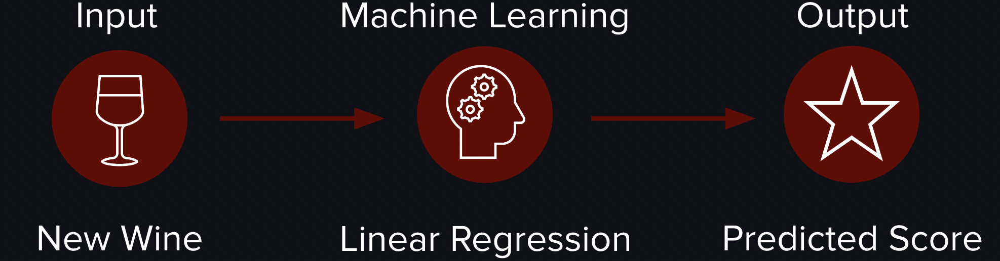
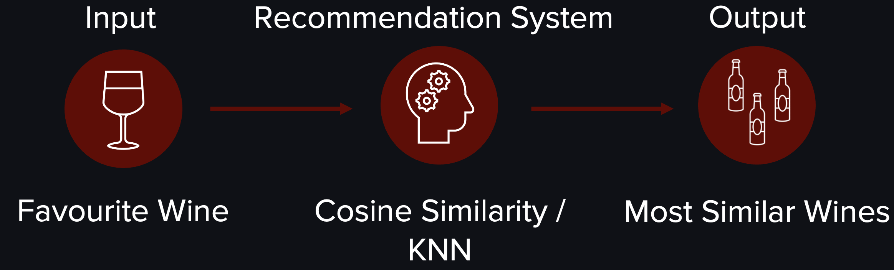

# Vivino Wine Score Prediction | Wine Recommender

## Project Overview
Welcome to the Wine Score Prediction & Recommendation System project! This project combines data science and machine learning techniques to address two challenges: predicting wine scores and providing personalised wine recommendations.

### Folder Structure

The following provides an overview of the folder structure used in this project:

* [Notebooks](./Notebooks)
  * [0_Scraper.ipynb](./Notebooks/0_Scraper.ipynb)
  * [1_Loading_and_Cleaning.ipynb](./Notebooks/1_Loading_and_Cleaning.ipynb)
  * [2_EDA.ipynb](./Notebooks/2_EDA.ipynb)
  * [3_Feature_Engineering.ipynb](./Notebooks/3_Feature_Engineering.ipynb)
  * [4_Modeling_Wine_Score_Prediction.ipynb](./Notebooks/4_Modeling_Wine_Score_Prediction.ipynb)
  * [4_Wine_Recommender.ipynb](./Notebooks/4_Wine_Recommender.ipynb)

* [Streamlit_App](./Streamlit_App)
  * [pages/](./Streamlit_App/pages)
    * [1_🔍_Wine_Insights.py](./Streamlit_App/pages/1_🔍_Wine_Insights.py)
    * [2_🍷_Wine_Recommender.py](./Streamlit_App/pages/2_🍷_Wine_Recommender.py)
    * [3_📍_Contact.py](./Streamlit_App/pages/3_📍_Contact.py)
  * [🍇_VinoVeritas.py](./Streamlit_App/🍇_VinoVeritas.py)

* [Presentation](./Presentation)
  * [Capstone_Presentation1.pdf](./Presentation/Capstone_Presentation1.pdf)
  * [Capstone_Presentation2.pdf](./Presentation/Capstone_Presentation2.pdf)
  * [Capstone_Presentation3.pdf](./Presentation/Capstone_Presentation3.pdf)

* [Flowchart](./Flowchart)
  * [Recommender.png](./Flowchart/Recommender.png)
  * [Score_Prediction.png](./Flowchart/Score_Prediction.png)

### Problem Statement

Overall, this project aims to help wine consumers choose a wine. 

While there are wine review websites, such as Vivino, that provide ratings to help people choose a wine, new wines often lack sufficient ratings to be considered trustworthy. One solution to this problem is a **wine score predictor**.

However, it is important to note that scores are subjective and can vary from person to person. Furthermore, some people may have a favourite wine and want to find one that matches their favourite. Therefore, a content-based **wine recommender** that suggests wines based on a favourite wine is another solution for this project.

### Solution Overview

1. Wine Score Prediction

The wine score predictor aims to predict wine quality scores using machine learning techniques. Wine quality assessment is crucial in the wine industry and involves evaluating various factors, such as chemical composition, geography, and consumer satisfaction. Wine review websites, such as Vivino, rely on customer reviews, which typically require a high number of reviews for a wine to receive a reliable score. Therefore, new wines without reviews have a lower chance of being purchased. The goal is to predict a score based on other features, which can increase demand for new but promising products. The machine learning model used for the wine score is a linear regression to give a numeric score prediction. 

2. Wine Recommender

Another outcome of this project is a content-based recommendation system based on taste, food and/or flavour of favourite wines. It uses the cosine similarity and KNN to find similar wines to the input wine. The output is a list of the top 10 most similar wines including additional information about the wine like similarity score, price and rating. Furthermore, the search can be limited with additional filters such as maximum price.

### Data Collection

The data used in this project was scraped from the website Vivino. The setup for the scrapping was used by the following user [Gugarose](https://github.com/gugarosa/viviner). The scraping code has been modified to scrap small amounts from the website as a dataframe and therefore avoid duplications (see Notebook: 0_Scraper). The collected data (csv) can be found [here](https://drive.google.com/drive/folders/1GjL5_z6pyaLerbafZw76XsMYZdK5VWIV?usp=sharing).

### Data Description

This project includes data on red wines. The different recommendation systems focus on the taste, food and/ or flavour features. 

- **Taste Feature** including body, intensity, tannin, sweetness and acidity

- **Food Features** which food goes well with the wine such as beef, game, pork.

- **Flavour Features** including 13 flavour groups such as oak, earth, red fruit and 485 subflavour groups.

- The wine score prediction includes three additional features: price, year and volume

### Results

1. Wine Score Prediction

The ridge linear regression model with a standard scaler achieved the best results with an alpha of 300, an average cv R-squared of 54.37%, a test R-squared of 52.44%, an RMSE test of 0.19, and an MAE test of 0.14. The model's coefficients offer insights into positive and negative indicators of wine review scores. Positive indicators include price, and sweetness, while negative indicators include subflavours such as earthy, food features blue cheese and cured meat. 

2. Wine Recommender

The recommendation system relies on the selected features to identify the most similar wines. Cosine Similarity is affected by the high number of subflavours, resulting in a lower similarity score. On the other hand, food features tend to achieve perfect similarity due to their consistent distribution across most wines. This trend is also observed when using the KNN technique, where the distance between the top match increases with the addition of subflavours while using only food features results in a distance of zero. Thus, the features **taste** and **flavour group** are the most suitable features for a recommendation model.

When comparing Cosine similarity and KNN, they produce similar results, particularly when considering only taste and flavour group features. Although both techniques can be computationally expensive, they should be manageable for this dataset. However, KNN's distance is harder to interpret than cosine similarity. **Cosine similarity** is the better choice in this case as it provides a clear and easily understandable range of similarity from 1 to -1, increasing the transparency and trustworthiness of the recommendation system.